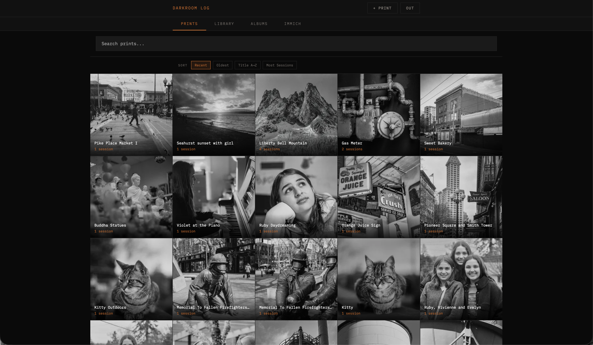

# Darkroom Log

A self-hosted darkroom printing log and analog photo library, built for Immich integration.



Each print page records full exposure data (shutter / aperture / ISO / lens), tags, every print
session you've made of it (paper, enlarger, lens, exposure, dodge/burn notes), and chips for any
album the print belongs to so you can jump straight to that album from the print itself.


Albums double as **public, shareable galleries** — each gets its own URL with a custom branded
header, optional slideshow, and pinch-zoom on every photo. No login required for viewers.


## What's new in v1.5.43

- **Server-side sized share** — the Share button now goes through `sharp` + mozjpeg on the server with JPEG quality iterated to a byte target. Sizes: **S** (≤500 KB / 1200 px) for SMS, **M** (≤1.5 MB / 2400 px) for messaging, **L** (≤2.7 MB / 4200 px — hard-capped for forum uploads), **XL** (full original Q100). Encoded outputs are disk-cached keyed by Immich `updatedAt` so a Lightroom republish auto-invalidates.
- **Two-step share modal** — Safari iOS revoked `navigator.share()` activation when the fetch took too long; the share button now opens a "Preparing image…" modal first and flips to "Tap to share" once the blob is ready. Desktop falls back to a Blob-URL save-to-disk with the same spinner.
- **Tiered progressive image loading** — detail and fullscreen views load thumbnail → small → preview → original on mobile (preview → original on desktop). Each tier swaps in as the next preloads; stale upgrades are dropped on navigation.
- **Race-free navigation** — nav-generation counter drops async results from superseded navigations; 400 ms cooldown prevents accidental double-skip from a stray click + swipe.
- **Phone-landscape detail view** — image full-width on top, metadata below, tab bar hidden, header pinned to the bottom of the viewport so Back is always reachable.
- **iOS double-tap fix** — synthetic clicks fired ~300 ms after a touch double-tap no longer leak into the fullscreen viewer's prev/next/close logic.
- **Force Refresh button (🔄)** in the detail view — one-tap SW cache flush + reload escape hatch.
- **Public album viewer parity** — public `/album/<slug>` fullscreen now uses the same `zoom.js` controller as the main app (pinch / wheel / drag-pan / double-tap-toggle to 2.5×) plus 2-stage progressive load. Hi-res originals actually decode now (CSS `will-change` trap fixed).
- **Library shift-click range select**, archive/delete-disappear-from-grid fixes, "share already in progress" alert suppressed, archived/trashed photos no longer reappear after a refetch.

## What's new in v1.5

- **In-Albums chips on every print and Recent photo** — see at a glance which Darkroom albums each image is in; click to jump straight to the album.
- **Public album detail view** — tapping a thumbnail in `/album/<slug>` opens a library-style two-column layout with EXIF (description, date, camera, lens, location), separate from the fullscreen Ken Burns slideshow.
- **Pinch-zoom fullscreen viewer** — public album fullscreen is now image-only with 1×–5× pinch, pan-when-zoomed, double-tap toggle, swipe-down to close. Trackpad two-finger swipe-up also closes.
- **Album metadata API** — expanded `/api/public/photo/:id` returns full EXIF (make, model, lens, focal length, shutter, aperture, ISO, date, city/state/country) for the public viewer. GPS lat/long never leave the server.
- **Mobile Load More smoothness** — fixed cumulative scroll drift across multi-page library loads; fast-path append now keeps the DOM above untouched.
- **Session arrow-key fix** — opening "+ Session" no longer leaks left/right arrows into print navigation, so sessions can't accidentally land on the wrong print.
- **Lazy-loaded albums** — opening a print or Recent photo before visiting the Albums tab no longer silently shows zero album chips; albums fetch on demand.

See [CHANGELOG.md](CHANGELOG.md) for full version history.

## Features

### Prints
- Log darkroom print sessions with exposure data, paper, technique, notes
- Split-grade and single-grade workflow support
- Tag filtering and session history per print
- Link prints to Immich photos via EXIF search

### Library
- Browse your full Immich photo library
- Sort by upload date or date taken (ascending/descending)
- **Combined search** — merges Immich text search and CLIP smart search into a single result set, something Immich's native UI doesn't offer
- Search by recognized person/face
- Filter chips: camera, lens, location, people
- **Compose filters** — person, chip, and text/smart search intersect server-side (e.g. "Ruby + Anacortes + 'beach'" returns only photos matching all three)
- Select mode with shift-click range selection

### Albums
- Create curated albums from your Immich library
- Drag-to-reorder photos
- Select and download originals with original filenames
- Shareable public links

### Immich Albums
- Browse your Immich albums as a grid
- **Sort photos by upload date or date taken** — a feature missing from Immich's native album view
- Filter by camera, lens, or location within an album
- Select mode with shift-click range selection
- Add Immich photos directly to Darkroom albums
- Full photo detail (EXIF, map, fullscreen, download, share)

### Slideshow
- **Smooth Ken Burns pan/zoom** — linear motion with no mid-cycle jumps or snap-back artifacts
- Title card with byline and photo count; circular play button to start
- Background music with fade-in; pause/resume synced to slideshow state
- Description overlay, fullscreen (`⤢`), auto-hide controls with mousemove keep-alive
- Swipe down to close; swipe left/right to navigate

### Performance
- **Fast library open** — photo metadata is folded into the initial `/api/immich/recent` response instead of fetched one-asset-at-a-time, so filter chips and search are ready immediately (~1s over a phone connection vs the ~60s an N+1 pattern would cost)
- **Right-sized thumbnails** — grid uses Immich's small thumbnail (~50 KB); detail view uses the 1440 px preview (retina-sharp); full original loads only when you tap to fullscreen
- **Progressive upgrade in detail view** — preview paints instantly, original quietly swaps in after a 400 ms dwell, and rapid navigation cancels the pending upgrade so swiping through photos doesn't waterfall megabytes of originals
- Service-worker-cached thumbnails survive app shell updates (`darkroom-thumbs-v1` cache, FIFO-bounded to 500 entries for iOS Safari quota)

### Mobile & PWA
- Fully responsive — designed and tested on iPhone
- Install to home screen via Safari → **Add to Home Screen** for a native app-like experience
- Runs as a standalone app — no browser chrome, no address bar
- Swipe gestures, tap zones, and smooth animations throughout

### Navigation & Gestures
- Swipe down in any photo detail to go back
- Swipe left/right (or tap edge zones) to navigate prev/next
- Scroll position preserved when opening and closing photos — no flash to top
- Keyboard: arrow keys and ESC work throughout

### Public Album
- Public album page (`/album/:slug`) — no login required, opens directly to slideshow
- **Configurable branded header** — brand name + site link (set via env vars) with inline slideshow button
- **Grid view** — click any photo to open it in a paused single-image view with Ken Burns zoom
- Rich link cards on Substack, iMessage, and social — OG meta tags injected server-side
- Embed in Squarespace, Substack, Webflow, or any iframe (`?embed` hides header)
- Swipe down to close slideshow; swipe left/right to navigate
- Safari and mobile compatible

## Security
- A+ security score (115/100, 10/10 tests)
- CSP: no `unsafe-inline` in script-src
- External JS with comprehensive event delegation
- Login rate limiting (10 attempts / 15 min per IP)
- HSTS, Referrer-Policy, X-Frame-Options, Permissions-Policy

## Requirements

- [Immich](https://immich.app) instance with API access
- Docker + Docker Compose

## Quick Start

```bash
git clone https://github.com/jaapjan14/darkroom-log
cd darkroom-log
cp docker-compose.yml docker-compose.override.yml
# Edit docker-compose.override.yml with your settings
docker compose up -d
```

## Configuration

| Variable | Required | Description |
|---|---|---|
| `APP_PASSWORD` | yes | Login password |
| `SESSION_SECRET` | yes | Random secret for session signing |
| `IMMICH_URL` | yes | Immich API URL e.g. `http://192.168.0.10:2283/api` |
| `IMMICH_KEY` | yes | Immich API key |
| `BRAND_NAME` | no | Public album header brand name (e.g. `Your Name Photography`). Leave blank to hide the brand block. |
| `BRAND_URL` | no | Public album header link destination (e.g. `https://yourdomain.com`) |
| `BRAND_SITE_LABEL` | no | Text shown next to the brand name (e.g. `yourdomain.com ↗`) |
| `CSP_FRAME_ANCESTORS` | no | Space-separated origins allowed to embed `/album/:slug` beyond `'self'`. Example: `https://*.squarespace.com https://*.substack.com` |

## Volumes

| Path | Description |
|---|---|
| `/data` | Prints database and filter cache |
| `/music` | MP3 files for slideshow music (optional) |

## Music

Drop MP3s (or folders of MP3s) into the `/music` volume. They'll appear in the slideshow settings dropdown automatically.

## Public Album Embed

```html
<iframe 
  src="https://your-darkroom.domain/album/your-album-slug?embed"
  width="100%" 
  height="350px" 
  frameborder="0"
  allowfullscreen>
</iframe>
```

## Changelog

See [CHANGELOG.md](CHANGELOG.md)

## Credits

Designed and maintained by [JJ Lakatua](https://lakatua.me) — analog photographer and homelab enthusiast — in collaboration with [Claude](https://claude.ai) by Anthropic.

This project was built through an ongoing human-AI collaboration. JJ provided the vision, domain expertise, testing, and direction. Claude assisted with architecture, implementation, and debugging across multiple sessions.
