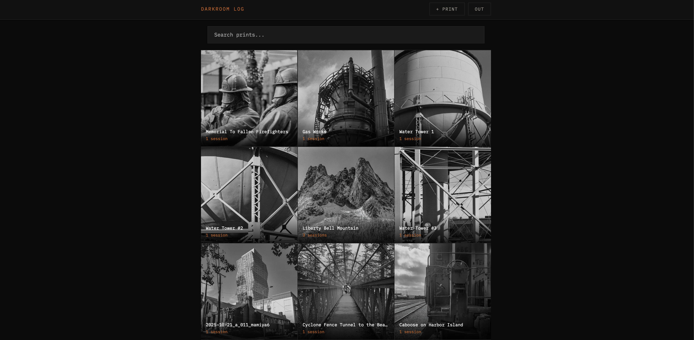
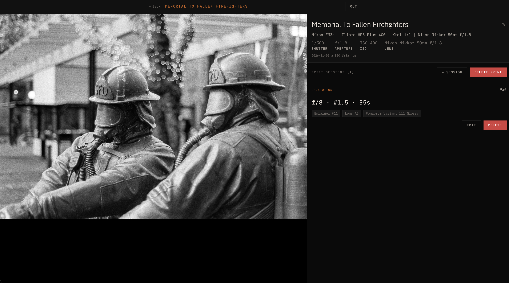

# Darkroom Log

A self-hosted darkroom print session logger with [Immich](https://immich.app) integration.

Built for analog photographers who want to keep track of enlarger settings, exposure times, paper choices, and dodge/burn notes alongside their scanned negatives.





## Features

- **Immich integration** — search your Immich library to link prints to scans
- **Per-image print sessions** — log multiple print sessions per negative
- **Single grade & split grade** — supports both printing techniques with editable grade labels
- **Camera & film metadata** — pulls EXIF and description from Immich automatically
- **Mobile-friendly** — designed to be used on your phone in the darkroom
- **Password protected** — single password authentication
- **Self-hosted** — all data stored locally in a JSON file

## Requirements

- Docker
- [Immich](https://immich.app) instance with API access

## Setup

### 1. Get your Immich API key

In Immich: **Account Settings → API Keys → New API Key**

### 2. Clone the repo

```bash
git clone https://github.com/yourusername/darkroom-log.git
cd darkroom-log
```

### 3. Configure

Edit `docker-compose.yml` and set:

```yaml
environment:
  - APP_PASSWORD=your-password
  - SESSION_SECRET=any-random-string
  - IMMICH_URL=http://your-immich-host:2283/api
  - IMMICH_KEY=your-immich-api-key
```

### 4. Run

```bash
docker compose up -d
```

Access at `http://localhost:3416`

## Data

Print sessions are stored in `./data/prints.json`. Back this file up — it's the only persistent data.

## Workflow

1. Make a print in the darkroom
2. During the wash, open Darkroom Log on your phone
3. Search for the negative in Immich
4. Log the session — enlarger, lens, paper, exposure, dodge/burn notes
5. Next session, pull up the print to see what worked last time

## Session Fields

- **Date** — auto-fills to today
- **Print size** — e.g. `9x6`, `11x14`
- **Enlarger** — enlarger number
- **Lens** — enlarger lens designation
- **Paper** — dropdown with common papers + custom entry
- **Technique** — Single Grade or Split Grade
- **Single grade** — f/stop, grade/filter, time
- **Split grade** — f/stop, low grade (highlights) + time, high grade (shadows) + time
- **Dodge/burn notes** — free text
- **Additional notes** — free text

## Paper Dropdown

Default papers included:
- Fomabrom Variant 111 Glossy
- Ilford Multigrade FB Classic Glossy
- Ilford Multigrade FB Warmtone Glossy
- Ilford Multigrade RC Deluxe

Select **Other...** to enter any paper name.

## Reverse Proxy

For external access, use a reverse proxy such as [Nginx Proxy Manager](https://nginxproxymanager.com) or [Caddy](https://caddyserver.com), or expose via [Cloudflare Tunnel](https://developers.cloudflare.com/cloudflare-one/connections/connect-networks/).

## License

MIT
